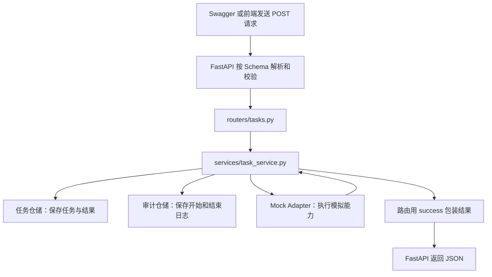

# FastAPI 后端逐步学习教程：从第一个接口到数据库准备

整理日期：2026-09-23。

适用项目：`D:\资料\01项目-内容治理\back`。运行环境为 Python 3.12、FastAPI、Uvicorn、uv。

本教程把前面逐次完成的操作整理为 45 个小步骤，每一步说明修改位置、代码、作用和验证方法。目标是理解内容安全治理平台的后端流程，算法暂用关键词规则和固定数据模拟。

阅读约定：标为“新建”时创建文件；标为“替换”时覆盖旧函数或旧代码块；标为“追加”时保留其他代码。不要把多版同名函数全部追加在一起，也不要把 Markdown 的三个反引号复制进 Python 文件。所有函数体使用 4 个空格缩进。

截至整理时，实际项目已经包含内存版任务、审计、资源、能力目录和分页；对话最后讲到的 `app/core/database.py` 尚未出现在项目中，因此第 45 步是接下来可以照着补写的数据库准备步骤。本文只整理学习过程，不自动修改应用代码。

## 阅读路线

| 步骤 | 学习内容 | 完成后的能力 |
| --- | --- | --- |
| 1—5 | 应用、路由、请求模型 | 服务可启动，接口能接收 JSON |
| 6—12 | 服务层、响应格式、任务仓储 | 执行、保存和查询模拟任务 |
| 13—16 | 审计日志 | 查询任务开始和结束记录 |
| 17—21 | 数据集、模型、指标资源 | 查询预置资源 |
| 22—29 | Adapter、能力目录、业务校验 | 扩展模拟能力并拒绝未知编码 |
| 30—32 | 版本关联、模拟评估 | 在任务中保存资源版本信息 |
| 33—38 | 新增数据集与资源日志 | 创建资源并留痕 |
| 39—40 | 更多模拟能力 | 价值评分与模型风险治理演示 |
| 41—44 | 返回模型和分页 | 明确响应结构、控制列表长度 |
| 45 | SQLite 基础文件 | 定义数据库连接与建表方法，尚未接入仓储 |

完整学习目录如下。每个包中的 `__init__.py` 可以为空，文件名前后都是两个下划线；`_init_.py` 不是同一个名字。Python 有些情况下允许没有 `__init__.py` 的命名空间包，但本教程统一使用普通包写法。

```text
back/
├─ pyproject.toml
├─ uv.lock
├─ app/
│  ├─ __init__.py
│  ├─ main.py
│  ├─ core/
│  │  ├─ __init__.py
│  │  ├─ response.py
│  │  └─ database.py              # 第 45 步准备创建
│  ├─ domain/
│  │  ├─ __init__.py
│  │  ├─ schemas.py
│  │  └─ capabilities.py
│  ├─ routers/
│  │  ├─ __init__.py
│  │  ├─ tasks.py
│  │  ├─ audit.py
│  │  ├─ resources.py
│  │  └─ capabilities.py
│  ├─ services/
│  │  ├─ __init__.py
│  │  ├─ task_service.py
│  │  └─ resource_service.py
│  ├─ repositories/
│  │  ├─ __init__.py
│  │  ├─ task_repository.py
│  │  ├─ audit_repository.py
│  │  └─ resource_repository.py
│  └─ adapters/
│     ├─ __init__.py
│     └─ mock_adapter.py
└─ data/
   └─ content_safety.db           # 将来初始化数据库时才会生成
```

这些文件夹的职责：

| 名称 | 通俗理解 | 负责什么 |
| --- | --- | --- |
| `main.py` | 总入口 | 创建应用、把各组接口接进来 |
| `routers` | 接待窗口 | 接收 HTTP 请求，调用服务，返回结果 |
| `domain/schemas.py` | 表单格式 | 约定请求和响应的字段 |
| `services` | 办事流程 | 校验、创建任务、调用能力、记录日志 |
| `repositories` | 存取数据的位置 | 当前操作列表，将来操作数据库 |
| `adapters` | 算法接入口 | 当前返回模拟结果，将来调用真实服务 |
| `core` | 公共工具 | 响应包装、数据库连接等 |

一次任务的调用流程：



## 第 1 步：创建并启动最小应用

**修改位置：** 新建 `app/main.py`。

**作用：** 得到一个能接收 HTTP 请求的后端应用，先确认运行环境和启动路径正确。

```python
from fastapi import FastAPI


app = FastAPI(
    title="内容安全治理平台",
    description="后端模拟接口学习项目",
    version="0.1.0",
)


@app.get("/health")
def health():
    return {"status": "ok", "message": "后端服务已启动"}


@app.get("/")
def root():
    return {"message": "欢迎使用内容安全治理平台后端", "docs": "/docs"}
```

如果是已有本项目，依赖已经在 `pyproject.toml` 中，安装依赖使用 `uv sync`；如果从空的 uv 项目学习，可用 `uv add fastapi "uvicorn[standard]"` 添加依赖，二者按实际情况选择。

在 `back` 根目录启动：

```powershell
uv run uvicorn app.main:app --app-dir . --reload --host 127.0.0.1 --port 8010
```

| 命令部分 | 作用 |
| --- | --- |
| `uv run` | 在项目的 Python 环境中执行命令 |
| `uvicorn` | 启动运行 FastAPI 的服务器 |
| `app.main` | 导入 `app/main.py` 模块 |
| 冒号后的 `app` | 使用该文件中的 `app = FastAPI(...)` 对象 |
| `--app-dir .` | 从当前目录查找应用模块 |
| `--reload` | 代码变化后自动重启，适合学习和开发 |
| `--host 127.0.0.1` | 监听本机地址 |
| `--port 8010` | 使用 8010 端口 |

**验证：** 终端出现 `Application startup complete.` 后，打开 [健康检查](http://127.0.0.1:8010/health) 和 [接口文档](http://127.0.0.1:8010/docs)。仅看到 `Uvicorn running` 还不够，启用 reload 时后续应用导入仍有可能失败。

原对话也演示过 `@app.on_event("startup")` 打印启动消息；它不是启动服务所必需的，新代码的启动初始化推荐使用 `lifespan`。这里先保留最小应用，数据库初始化留到后续。

## 第 2 步：创建第一个任务路由

**修改位置：** 新建 `app/routers/__init__.py` 和 `app/routers/tasks.py`；前者留空。

**作用：** 把任务接口集中放在一个文件里，避免所有接口都挤在 `main.py`。

```python
from fastapi import APIRouter


router = APIRouter()


@router.post("/tasks/execute")
def execute_task():
    return {"message": "模拟任务执行完成", "status": "succeeded"}
```

**验证：** 目前只是定义接口，主应用还没有注册这个路由，因此 `/docs` 中暂时看不到它。

## 第 3 步：在主应用注册任务路由

**修改位置：** 修改 `app/main.py`，顶部增加导入，在创建 `app` 后注册。

```python
from app.routers import tasks
```

```python
app.include_router(
    tasks.router,
    prefix="/api/v1",
    tags=["任务管理"],
)
```

**作用：** 把 `tasks.py` 中的接口挂到应用上。

| 参数 | 含义 |
| --- | --- |
| `tasks.router` | `tasks.py` 中创建的 `APIRouter` 对象 |
| `prefix="/api/v1"` | 给该组接口统一加路径前缀 |
| `tags=["任务管理"]` | 在 Swagger 文档中按“任务管理”分组 |

最终地址为 `/api/v1` + `/tasks/execute`，即 `POST /api/v1/tasks/execute`。

**验证：** 刷新 `/docs`，展开该 POST 接口，点击 `Try it out`、`Execute`，应得到模拟结果。

## 第 4 步：定义任务请求的数据格式

**修改位置：** 新建 `app/domain/__init__.py` 和 `app/domain/schemas.py`。

**作用：** 约定前端创建任务时需要提交哪些字段，并让 FastAPI 使用 Pydantic 进行验证。

```python
from typing import Any
from pydantic import BaseModel, Field


class ExecuteTaskRequest(BaseModel):
    capability_code: str
    name: str | None = None
    input: dict[str, Any] = Field(default_factory=dict)
    config: dict[str, Any] = Field(default_factory=dict)
```

`capability_code` 没有默认值，必须传；`name` 可以不传；`default_factory=dict` 为每个请求生成默认空字典。

**验证：** 本步还未在路由中使用模型，因此接口暂时没有变化。

## 第 5 步：让任务路由接收 JSON

**修改位置：** 在 `app/routers/tasks.py` 中导入模型，并替换原来的任务函数。

```python
from app.domain.schemas import ExecuteTaskRequest


@router.post("/tasks/execute")
def execute_task(request: ExecuteTaskRequest):
    return {
        "message": "模拟任务执行完成",
        "status": "succeeded",
        "capability_code": request.capability_code,
        "name": request.name,
        "input": request.input,
        "config": request.config,
    }
```

**作用：** 将请求体 JSON 转成 `ExecuteTaskRequest` 对象，可以用 `request.input` 等方式读取。

**验证：** 在 Swagger 的 `Request body` 输入框中填入下面 JSON，点击 `Execute`。

```json
{
  "capability_code": "semantic_risk",
  "name": "第一条风险识别任务",
  "input": {"content": "这是一段待检测的文本"},
  "config": {"threshold": 0.8}
}
```

返回应包含刚才的输入。删除 `capability_code` 再提交，会得到 HTTP 422。注意 `input: dict[str, Any]` 目前只要求 `input` 是字典，没有完整验证其内部的 `content` 等字段。

## 第 6 步：创建任务服务层

**修改位置：** 新建 `app/services/__init__.py` 和 `app/services/task_service.py`。

**作用：** 把“怎么处理任务”的业务规则移到服务层，路由保留 HTTP 接口职责。

```python
from app.domain.schemas import ExecuteTaskRequest


def run_mock_task(request: ExecuteTaskRequest):
    if request.capability_code == "semantic_risk":
        content = request.input.get("content", "")

        if "诈骗" in content:
            risk_level = "high"
            reason = "文本中包含“诈骗”关键词"
        else:
            risk_level = "low"
            reason = "文本未命中当前模拟风险关键词"

        return {
            "message": "语义风险识别完成",
            "status": "succeeded",
            "capability_code": request.capability_code,
            "risk_level": risk_level,
            "risk_category": "content_safety",
            "confidence": 0.91,
            "reason": reason,
            "input": request.input,
        }

    return {
        "message": "该模拟能力暂未实现",
        "status": "failed",
        "capability_code": request.capability_code,
    }
```

**验证：** 新文件暂未接入路由。关键词和 `0.91` 都是演示值，`threshold` 此时不参与判断。

## 第 7 步：路由调用任务服务

**修改位置：** 在 `app/routers/tasks.py` 导入服务，并替换执行函数。

```python
from app.services.task_service import run_mock_task


@router.post("/tasks/execute")
def execute_task(request: ExecuteTaskRequest):
    result = run_mock_task(request)
    return result
```

**作用：** 打通“路由接收 → 服务处理 → 返回 JSON”。

**验证：** 把请求的 `content` 改为 `这是一个诈骗信息，请勿相信。`，应返回 `risk_level: "high"`。这只是关键词命中，不能说明文本真的有害；正常的防诈骗提醒也会命中当前规则。

## 第 8 步：创建统一成功响应工具

**修改位置：** 新建 `app/core/__init__.py` 和 `app/core/response.py`。

```python
from datetime import datetime


def success(data, message="请求成功"):
    return {
        "code": 0,
        "message": message,
        "data": data,
        "timestamp": datetime.now().isoformat(),
    }
```

**作用：** 为业务接口提供共同的外层字段，方便前端解析。

**验证：** 本步只是定义工具函数；时间使用本机时间且不带时区，沿用当前教学代码。

## 第 9 步：用 success 包装任务结果

**修改位置：** 在 `app/routers/tasks.py` 中导入工具，替换任务函数。

```python
from app.core.response import success


@router.post("/tasks/execute")
def execute_task(request: ExecuteTaskRequest):
    result = run_mock_task(request)
    return success(data=result, message="任务执行完成")
```

**作用：** 把服务返回的数据放入外层响应的 `data` 字段。

**验证：** 再提交同一个请求，实际结果应位于 `data.risk_level` 等字段中。外层 `message` 描述接口处理情况，内层 `message` 来自业务服务。

## 第 10 步：创建任务仓储

**修改位置：** 新建 `app/repositories/__init__.py` 和 `app/repositories/task_repository.py`。

```python
TASKS = []


def save(task: dict):
    TASKS.append(task)
    return task


def find_by_id(task_id: str):
    for task in TASKS:
        if task["task_id"] == task_id:
            return task
    return None


def update(task_id: str, changes: dict):
    task = find_by_id(task_id)
    if task is None:
        return None
    task.update(changes)
    return task


def list_all():
    return TASKS
```

**作用：** 用四个函数封装任务的存、查、改，服务层不直接操作列表。

**验证与理解：** `TASKS` 确实是 Python 列表，每个元素是一条任务字典。服务重启会清空列表。这里查询返回的是原字典对象，所以 `task.update()` 会修改列表中的那条记录。

## 第 11 步：执行任务时保存记录和结果

**修改位置：** 替换 `app/services/task_service.py`。

```python
from datetime import datetime
from uuid import uuid4

from app.domain.schemas import ExecuteTaskRequest
from app.repositories.task_repository import save, update


def run_mock_task(request: ExecuteTaskRequest):
    task_id = "tsk_" + uuid4().hex[:8]
    task = {
        "task_id": task_id,
        "name": request.name or "未命名任务",
        "capability_code": request.capability_code,
        "status": "running",
        "input": request.input,
        "config": request.config,
        "result": None,
        "created_at": datetime.now().isoformat(),
        "finished_at": None,
    }
    save(task)

    if request.capability_code == "semantic_risk":
        content = request.input.get("content", "")
        matched = "诈骗" in content
        result = {
            "risk_level": "high" if matched else "low",
            "risk_category": "content_safety",
            "confidence": 0.91,
            "reason": (
                "文本中包含“诈骗”关键词"
                if matched else "文本未命中当前模拟风险关键词"
            ),
        }
        status = "succeeded"
    else:
        result = {"error": "该模拟能力暂未实现"}
        status = "failed"

    finished_task = update(task_id, {
        "status": status,
        "result": result,
        "finished_at": datetime.now().isoformat(),
    })
    return finished_task
```

**作用：** 先保存 `running` 任务，再保存执行结果和最终状态。

这里纠正了早期片段把所有任务都设为 `succeeded` 的问题：未知能力应为 `failed`。短 UUID 用于学习演示，不保证绝对不会重复。

**验证：** POST 返回的 `data` 中应有 `task_id`、时间和 `result`，风险等级的位置变为 `data.result.risk_level`。

## 第 12 步：增加任务列表和详情查询

**修改位置：** 在 `app/routers/tasks.py` 中补充导入，追加两个函数，保留 POST 接口。

```python
from fastapi import APIRouter, HTTPException
from app.repositories.task_repository import find_by_id, list_all
```

```python
@router.get("/tasks")
def get_tasks():
    return success(data=list_all(), message="任务列表查询成功")


@router.get("/tasks/{task_id}")
def get_task_detail(task_id: str):
    task = find_by_id(task_id)
    if task is None:
        raise HTTPException(status_code=404, detail="任务不存在")
    return success(data=task, message="任务详情查询成功")
```

**作用：** 查询刚创建的任务，理解路径参数 `{task_id}` 如何传入函数。

**验证：** 保存代码后先 POST 新任务，再 GET 列表，复制真实 `task_id` 查询详情。GET 详情中的 ID 不存在时返回 HTTP 404；默认错误体为 `{"detail": "任务不存在"}`。

## 第 13 步：创建审计日志仓储

**修改位置：** 新建 `app/repositories/audit_repository.py`。

```python
from datetime import datetime


AUDIT_LOGS = []


def add_log(
    task_id: str,
    event_type: str,
    request_data: dict | None = None,
    response_data: dict | None = None,
):
    log = {
        "log_id": len(AUDIT_LOGS) + 1,
        "task_id": task_id,
        "event_type": event_type,
        "request": request_data,
        "response": response_data,
        "created_at": datetime.now().isoformat(),
    }
    AUDIT_LOGS.append(log)
    return log


def list_all():
    return AUDIT_LOGS


def list_by_task_id(task_id: str):
    return [log for log in AUDIT_LOGS if log["task_id"] == task_id]
```

**作用：** 存储任务执行过程。任务记录反映当前状态，日志记录发生过的事件。

**验证：** 此时还没有人调用 `add_log()`，列表为空是正常的。

## 第 14 步：任务开始和结束时写日志

**修改位置：** 修改 `app/services/task_service.py`。

顶部加入：

```python
from app.repositories.audit_repository import add_log
```

在 `save(task)` 后插入：

```python
    add_log(
        task_id=task_id,
        event_type="task_started",
        request_data={
            "capability_code": request.capability_code,
            "input": request.input,
            "config": request.config,
        },
    )
```

在 `finished_task = update(...)` 执行结束后、`return finished_task` 之前插入：

```python
    event_type = "task_finished" if status == "succeeded" else "task_failed"
    add_log(
        task_id=task_id,
        event_type=event_type,
        response_data=result,
    )
```

**作用：** 同一任务 ID 对应开始和结束两条日志；开始记录输入，结束记录结果。

**验证：** 执行新任务后应产生两条日志，目前还需下一步提供 HTTP 查询入口。此时只处理正常返回或返回 `error` 字段的情况，尚未完整捕获算法运行时异常。

## 第 15 步：创建审计查询路由

**修改位置：** 新建 `app/routers/audit.py`。

```python
from fastapi import APIRouter

from app.core.response import success
from app.repositories.audit_repository import list_all, list_by_task_id


router = APIRouter()


@router.get("/audit/logs")
def get_audit_logs():
    return success(data=list_all(), message="审计日志查询成功")


@router.get("/audit/logs/{task_id}")
def get_task_audit_logs(task_id: str):
    return success(
        data=list_by_task_id(task_id),
        message="任务审计日志查询成功",
    )
```

**作用：** 支持查询全部日志，或仅查询某个任务的日志。

**验证：** 尚未注册，因此 `/docs` 暂时不显示本文件中的接口。

## 第 16 步：注册审计路由并验证日志

**修改位置：** 修改 `app/main.py` 的导入，追加注册。

```python
from app.routers import tasks, audit
```

```python
app.include_router(audit.router, prefix="/api/v1", tags=["审计日志"])
```

**作用：** 把审计查询接口接入主应用。

**验证：** 按以下顺序操作，中途不要修改 Python 文件：

1. POST `/api/v1/tasks/execute` 创建任务。
2. GET `/api/v1/audit/logs`，查看 `task_started` 和 `task_finished`。
3. 使用该任务的 ID 查询 `/api/v1/audit/logs/{task_id}`。

如果仍返回 `data: []`，检查实际 POST 是否成功、服务是否重启、服务函数是否调用了两次 `add_log()`。仅凭 HTTP 200 不能证明日志写入链路正确。

## 第 17 步：创建数据集资源仓储

**修改位置：** 新建 `app/repositories/resource_repository.py`。

```python
RESOURCES = {
    "datasets": [
        {
            "id": 1,
            "name": "跨文化交流语料",
            "version": "v1.0.0",
            "description": "用于内容安全测试的模拟数据集",
        },
        {
            "id": 2,
            "name": "行业风险标注数据集",
            "version": "v1.0.0",
            "description": "包含风险标签的模拟数据集",
        },
    ]
}


def list_resources(resource_type: str):
    return RESOURCES.get(resource_type, [])


def find_resource(resource_type: str, resource_id: int):
    for resource in list_resources(resource_type):
        if resource["id"] == resource_id:
            return resource
    return None
```

**作用：** 用一个字典管理不同类型的资源；`datasets` 对应的数据是数据集列表。

**验证：** 此时没有 HTTP 接口。理解 `find_resource("datasets", 1)` 会查到第一条资源。

## 第 18 步：创建数据集查询路由

**修改位置：** 新建 `app/routers/resources.py`。

```python
from fastapi import APIRouter, HTTPException

from app.core.response import success
from app.repositories.resource_repository import find_resource, list_resources


router = APIRouter()


@router.get("/datasets")
def get_datasets():
    return success(
        data=list_resources("datasets"),
        message="数据集列表查询成功",
    )


@router.get("/datasets/{dataset_id}")
def get_dataset_detail(dataset_id: int):
    dataset = find_resource("datasets", dataset_id)
    if dataset is None:
        raise HTTPException(status_code=404, detail="数据集不存在")
    return success(data=dataset, message="数据集详情查询成功")
```

**作用：** 定义数据集列表和详情查询。`dataset_id: int` 让 FastAPI 将路径内容解析为整数。

**验证：** 路由注册后可用 `/datasets/1` 查询详情；非整数路径值会验证失败。

## 第 19 步：注册数据资源路由

**修改位置：** 修改 `app/main.py`。

```python
from app.routers import tasks, audit, resources
```

在已有注册后追加：

```python
app.include_router(resources.router, prefix="/api/v1", tags=["数据资源"])
```

**作用：** 主应用现在有任务、审计、数据资源三组路由对象。

**验证：** GET `/api/v1/datasets` 应返回两个预置数据集，GET `/api/v1/datasets/1` 返回第一条。

## 第 20 步：增加模型和指标模拟资源

**修改位置：** 在 `app/repositories/resource_repository.py` 的 `RESOURCES` 字典内部增加 `models`、`metrics` 两个键，保留 `datasets` 和查询函数。

以下片段是要加入字典内部的键值项；不要写到 `RESOURCES` 大括号外，前一项后面需有逗号。

```python
    "models": [
        {
            "id": 1,
            "name": "内容安全识别模型",
            "version": "v1.0.0",
            "status": "running",
            "description": "用于模拟语义风险识别的模型",
        },
        {
            "id": 2,
            "name": "多模态审核模型",
            "version": "v1.0.0",
            "status": "ready",
            "description": "用于模拟图文内容审核的模型",
        },
    ],
    "metrics": [
        {
            "id": 1,
            "code": "risk_recall",
            "name": "风险召回率",
            "target": 0.95,
            "unit": "%",
        },
        {
            "id": 2,
            "code": "false_positive_rate",
            "name": "误报率",
            "target": 0.05,
            "unit": "%",
        },
    ],
```

**作用：** 同一套仓储查询函数可以复用于三类资源。

**验证与说明：** 模型状态只是演示字段，没有部署真实模型；指标数值按 0—1 的比例保存，`0.95` 展示为 `95%`，不能直接显示成 `0.95%`。后续应明确单位约定和比较方向：召回率至少达到目标，误报率不能超过目标。

## 第 21 步：增加模型和指标查询接口

**修改位置：** 在 `app/routers/resources.py` 末尾追加。

```python
@router.get("/models")
def get_models():
    return success(data=list_resources("models"), message="模型列表查询成功")


@router.get("/metrics")
def get_metrics():
    return success(data=list_resources("metrics"), message="指标列表查询成功")
```

**作用：** 让前端读取模型目录和指标目录。

**验证：** 刷新 `/docs`，调用 GET `/api/v1/models` 和 GET `/api/v1/metrics`。不用再次注册 `resources.router`，已有注册会在重新加载时包含这些新接口。

## 第 22 步：把模拟算法拆到 Adapter

**修改位置：** 新建 `app/adapters/__init__.py` 和 `app/adapters/mock_adapter.py`。

```python
def execute_mock_capability(capability_code: str, input_data: dict):
    if capability_code == "semantic_risk":
        content = input_data.get("content", "")

        if "诈骗" in content:
            risk_level = "high"
            reason = "文本中包含“诈骗”关键词"
        else:
            risk_level = "low"
            reason = "文本未命中当前模拟风险关键词"

        return {
            "risk_level": risk_level,
            "risk_category": "content_safety",
            "confidence": 0.91,
            "reason": reason,
        }

    return {"error": f"暂未实现能力：{capability_code}"}
```

**作用：** 将算法入口与任务编排分离。将来调用真实服务时，可以替换能力实现，保留任务保存和日志逻辑。

**验证：** 新文件还没有被服务层调用；下一步完成连接。

## 第 23 步：让服务层调用 Adapter

**修改位置：** 在 `app/services/task_service.py` 顶部导入：

```python
from app.adapters.mock_adapter import execute_mock_capability
```

把原来直接判断 `semantic_risk`、检查“诈骗”并生成结果的整块代码替换为：

```python
    result = execute_mock_capability(
        capability_code=request.capability_code,
        input_data=request.input,
    )

    if "error" in result:
        status = "failed"
    else:
        status = "succeeded"
```

保留前面的创建任务、开始日志，以及后面的 `update()`、结束日志和返回。

**作用：** 服务只处理执行流程；Adapter 负责各项能力的结果。

**验证：** 同样的风险识别请求应返回同样结果，而且任务与两条日志仍能查询到。

## 第 24 步：增加异常数据检测能力

**修改位置：** 在 `app/adapters/mock_adapter.py` 的函数内部、最终错误返回之前插入。

```python
    if capability_code == "anomaly_detect":
        content = input_data.get("content", "")

        if "异常" in content or "污染" in content:
            return {
                "anomaly": True,
                "anomaly_type": "data_pollution",
                "risk_score": 0.88,
                "reason": "文本命中“异常”或“污染”模拟规则",
            }

        return {
            "anomaly": False,
            "anomaly_type": None,
            "risk_score": 0.12,
            "reason": "文本未命中异常数据模拟规则",
        }
```

**作用：** 在同一个任务入口下增加第二项能力。

**验证：** POST 请求如下，查看 `data.result.anomaly` 是否为 `true`。

```json
{
  "capability_code": "anomaly_detect",
  "name": "异常数据检测任务",
  "input": {"content": "这是一条疑似污染的异常数据。"},
  "config": {}
}
```

## 第 25 步：建立能力目录

**修改位置：** 新建 `app/domain/capabilities.py`。

```python
CAPABILITIES = {
    "semantic_risk": {
        "label": "语义风险识别",
        "category": "内容安全",
    },
    "anomaly_detect": {
        "label": "异常数据检测",
        "category": "数据治理",
    },
}


def is_supported(capability_code: str) -> bool:
    return capability_code in CAPABILITIES
```

**作用：** 集中登记平台支持的能力编码和展示名称。

**验证：** 目前只是定义目录与判断函数，还没有查询接口，也尚未在任务创建前调用校验。

## 第 26 步：创建能力目录查询路由

**修改位置：** 新建 `app/routers/capabilities.py`。

```python
from fastapi import APIRouter

from app.core.response import success
from app.domain.capabilities import CAPABILITIES


router = APIRouter()


@router.get("/capabilities")
def get_capabilities():
    return success(data=CAPABILITIES, message="能力目录查询成功")
```

**作用：** 前端可以读取支持的能力及中文名称，生成选择列表。

**验证：** 下一个步骤注册后才可调用。

## 第 27 步：注册能力目录路由

**修改位置：** 修改 `app/main.py` 的导入和注册。

```python
from app.routers import tasks, audit, resources, capabilities
```

```python
app.include_router(capabilities.router, prefix="/api/v1", tags=["能力目录"])
```

**作用：** 第四组路由对象接入主应用。

**验证：** GET `/api/v1/capabilities` 的 `data` 应有 `semantic_risk` 和 `anomaly_detect` 两个键。

## 第 28 步：增加统一失败响应工具

**修改位置：** 在 `app/core/response.py` 的 `success()` 后追加。

```python
def fail(message: str, code: int = 400):
    return {
        "code": code,
        "message": message,
        "data": None,
        "timestamp": datetime.now().isoformat(),
    }
```

**作用：** 为业务校验失败提供共同的 JSON 格式。

**验证与说明：** 这里 `code` 是 JSON 中的业务字段。返回这个普通字典不会自动把 HTTP 状态码改为 400；这是当前教学实现的行为。后续若要返回真正的 HTTP 400，还需要设置 HTTP 响应状态。

## 第 29 步：执行前校验能力编码

**修改位置：** `app/services/task_service.py` 顶部导入：

```python
from app.domain.capabilities import is_supported
```

在 `run_mock_task()` 开头、生成任务 ID 之前加入：

```python
    if not is_supported(request.capability_code):
        raise ValueError(f"不支持的能力编码：{request.capability_code}")
```

在 `app/routers/tasks.py` 把响应导入改为 `success, fail`，并替换任务函数：

```python
from app.core.response import success, fail


@router.post("/tasks/execute")
def execute_task(request: ExecuteTaskRequest):
    try:
        result = run_mock_task(request)
        return success(data=result, message="任务执行完成")
    except ValueError as error:
        return fail(message=str(error), code=400)
```

**作用：** 在创建任务之前拦截未知能力。服务抛出业务错误，路由将其转为响应。

**验证：** 传入 `"capability_code": "unknown_test"`，应返回业务 `code: 400`，且不新增任务和任务日志。按当前实现，Swagger 的 HTTP 状态仍会显示 200，原因见第 28 步。

## 第 30 步：关联数据集并记录版本

**修改位置：** 在 `app/services/task_service.py` 导入资源查询函数。

```python
from app.repositories.resource_repository import find_resource
```

在能力校验后、创建任务前加入：

```python
    dataset_id = request.input.get("dataset_id")
    dataset_version = None

    if dataset_id is not None:
        dataset = find_resource("datasets", dataset_id)
        if dataset is None:
            raise ValueError(f"数据集不存在：{dataset_id}")
        dataset_version = dataset["version"]
```

在 `task = {...}` 内增加一项：

```python
        "dataset_version": dataset_version,
```

**作用：** 校验引用的数据集存在，并将当时的版本记录在任务上；数据集 ID 已保存在任务的 `input.dataset_id` 中。

**验证：** 请求的 `input` 加上 `"dataset_id": 1`，任务的 `dataset_version` 应为 `"v1.0.0"`；不存在的 ID 会被拒绝。这里尚未读取数据集里的样本，实际风险识别仍读取传入的 `content`。

## 第 31 步：关联模型并记录版本

**修改位置：** 在同一服务文件中，数据集校验后、创建任务前加入。

```python
    model_id = request.input.get("model_id")
    model_version = None

    if model_id is not None:
        model = find_resource("models", model_id)
        if model is None:
            raise ValueError(f"模型不存在：{model_id}")
        model_version = model["version"]
```

在任务字典中增加：

```python
        "model_version": model_version,
```

**作用：** 留下模型 ID 和版本信息，供后续追踪。

**验证：** 提交如下 JSON，任务应同时带有数据集和模型版本。

```json
{
  "capability_code": "semantic_risk",
  "name": "关联数据集和模型的风险识别任务",
  "input": {
    "dataset_id": 1,
    "model_id": 1,
    "content": "这是一个诈骗信息，请勿相信。"
  },
  "config": {}
}
```

这一步是资源关联，尚未执行真实模型调用。`dataset_id`、`model_id` 在当前示例中应传 JSON 数字。

## 第 32 步：增加测试评估模拟能力

**修改位置：** 在 `app/domain/capabilities.py` 的目录字典内增加：

```python
    "evaluation": {
        "label": "测试评估",
        "category": "测试评估",
    },
```

在 `app/adapters/mock_adapter.py` 中，最终错误返回之前加入：

```python
    if capability_code == "evaluation":
        metric_code = input_data.get("metric_code", "risk_recall")

        return {
            "metric_code": metric_code,
            "metric_name": "风险召回率",
            "value": 0.96,
            "target": 0.95,
            "passed": True,
            "reason": "模拟评估值高于目标值",
        }
```

**作用：** 演示评估结果如何通过统一任务流程保存和展示。

**验证：** 提交以下 JSON。

```json
{
  "capability_code": "evaluation",
  "name": "风险召回率测试",
  "input": {"dataset_id": 2, "model_id": 1, "metric_code": "risk_recall"},
  "config": {}
}
```

该片段沿用对话中的固定召回率示例，没有用预测结果和标准标签计算。当前只用 `risk_recall` 演示；把 `metric_code` 改成其他值并不会自动切换指标名称、公式或比较方向。

如果提示“不支持的能力编码：evaluation”，先查 GET `/capabilities` 中有没有该键，再检查目录文件是否保存、是否放在大括号内部。仅给 Adapter 新增分支，不会自动登记能力。

## 第 33 步：定义创建数据集的请求模型

**修改位置：** 在 `app/domain/schemas.py` 的 `ExecuteTaskRequest` 类后追加同级类。

```python
class CreateDatasetRequest(BaseModel):
    name: str
    description: str = ""
    record_count: int = 0
    languages: list[str] = Field(default_factory=list)
```

**作用：** 约定新增数据集需要提交的名称、说明、条数和语言列表。复用顶部的 `BaseModel`、`Field` 导入。

**验证：** 此时只定义结构，还不能通过 HTTP 创建数据集。当前版本只声明基础类型，后续可再限制名称非空、样本数量不能为负数。

## 第 34 步：在仓储中保存新数据集

**修改位置：** 在 `app/repositories/resource_repository.py` 末尾追加。

```python
def create_dataset(data: dict):
    datasets = RESOURCES["datasets"]

    if datasets:
        new_id = max(dataset["id"] for dataset in datasets) + 1
    else:
        new_id = 1

    new_dataset = {
        "id": new_id,
        "name": data["name"],
        "version": "v1.0.0",
        "description": data["description"],
        "record_count": data["record_count"],
        "languages": data["languages"],
    }
    datasets.append(new_dataset)
    return new_dataset
```

**作用：** 生成一个演示 ID，给新资源设置初始版本，再放入内存列表。

**验证：** 下一步接入 HTTP 接口后测试。此处只保存数据集描述信息，`record_count` 是用户提交的数字，没有上传或统计真实文件。

## 第 35 步：增加创建数据集的 POST 接口

**修改位置：** 在 `app/routers/resources.py` 增加以下导入。已有同模块导入时合并，避免重复。

```python
from app.domain.schemas import CreateDatasetRequest
from app.repositories.resource_repository import (
    create_dataset,
    find_resource,
    list_resources,
)
```

在已有查询函数之外增加：

```python
@router.post("/datasets")
def create_new_dataset(request: CreateDatasetRequest):
    dataset = create_dataset({
        "name": request.name,
        "description": request.description,
        "record_count": request.record_count,
        "languages": request.languages,
    })
    return success(data=dataset, message="数据集创建成功")
```

**作用：** 从前端接收数据集元信息，并调用仓储保存。

**验证：** POST `/api/v1/datasets` 提交：

```json
{
  "name": "新建风险语料库",
  "description": "用于演示新增数据集",
  "record_count": 1000,
  "languages": ["zh", "en"]
}
```

再 GET `/api/v1/datasets`，应看到新增记录。`POST /datasets` 与 `GET /datasets` 路径相同但方法不同，是两个不同接口。

## 第 36 步：创建资源服务层

**修改位置：** 新建 `app/services/resource_service.py`。

```python
from app.domain.schemas import CreateDatasetRequest
from app.repositories.resource_repository import create_dataset


def create_new_dataset(request: CreateDatasetRequest):
    dataset_data = {
        "name": request.name,
        "description": request.description,
        "record_count": request.record_count,
        "languages": request.languages,
    }
    return create_dataset(dataset_data)
```

**作用：** 为创建资源的业务规则预留服务层，下一步从路由转过来调用；再后面在这里加入审计。

**验证：** 当前该函数尚未被路由调用，接口行为不变。

## 第 37 步：创建数据集时改为调用服务

**修改位置：** 在 `app/routers/resources.py` 导入服务函数，并删除对仓储 `create_dataset` 的直接导入；保留仓储查询函数导入。

```python
from app.services.resource_service import create_new_dataset
```

将原 POST 接口替换为：

```python
@router.post("/datasets")
def create_dataset_api(request: CreateDatasetRequest):
    dataset = create_new_dataset(request)
    return success(data=dataset, message="数据集创建成功")
```

**作用：** 形成“资源路由 → 资源服务 → 资源仓储”的创建流程。

路由函数改名为 `create_dataset_api`，避免与导入的服务函数 `create_new_dataset` 同名，覆盖导入后造成错误的自调用。

**验证：** 使用第 35 步的请求再创建一次，功能应与重构前相同。

## 第 38 步：创建数据集时记录审计日志

**修改位置：** 在 `app/repositories/audit_repository.py` 中，将 `add_log()` 的首个参数类型改为：

```python
    task_id: str | None,
```

这里允许显式传 `None`，并不表示调用时可以省略这个参数；要允许省略还需要默认值。

替换 `app/services/resource_service.py`：

```python
from app.domain.schemas import CreateDatasetRequest
from app.repositories.audit_repository import add_log
from app.repositories.resource_repository import create_dataset


def create_new_dataset(request: CreateDatasetRequest):
    dataset_data = {
        "name": request.name,
        "description": request.description,
        "record_count": request.record_count,
        "languages": request.languages,
    }

    dataset = create_dataset(dataset_data)

    add_log(
        task_id=None,
        event_type="dataset_created",
        request_data=dataset_data,
        response_data=dataset,
    )
    return dataset
```

**作用：** 将资源创建操作纳入日志。这种操作不属于某个能力任务，所以 `task_id` 为空，数据集 ID 在日志的 `response.id` 中。

**验证：** POST 新数据集后查询全部审计日志，应看到 `dataset_created`。按某个任务 ID 查询日志时不会包含这条资源创建日志。

## 第 39 步：增加数据价值评分能力

**修改位置：** 在 `app/domain/capabilities.py` 的目录字典内部增加：

```python
    "value_score": {
        "label": "数据价值评分",
        "category": "数据治理",
    },
```

在 `app/adapters/mock_adapter.py` 的最终错误返回之前增加：

```python
    if capability_code == "value_score":
        return {
            "overall_score": 0.86,
            "dimensions": {
                "quality": 0.90,
                "representativeness": 0.84,
                "rarity": 0.79,
                "credibility": 0.91,
            },
            "level": "high",
            "reason": "模拟数据在质量、代表性和可信度维度表现较好",
        }
```

**作用：** 为数据治理页面提供多维评分的模拟结果结构。

**验证：** POST `/tasks/execute` 时传 `capability_code: "value_score"`，`input: {"dataset_id": 1}`；返回应包含 `overall_score` 和 `dimensions`。这些值是固定演示值，尚未实际计算数据价值。

## 第 40 步：增加模型风险治理能力

**修改位置：** 在能力目录内部增加：

```python
    "model_risk_governance": {
        "label": "模型风险治理",
        "category": "模型训推",
    },
```

在 Adapter 的最终错误返回之前增加：

```python
    if capability_code == "model_risk_governance":
        prompt = input_data.get("prompt", "")
        return {
            "original_prompt": prompt,
            "input_risk_level": "high" if "诈骗" in prompt else "low",
            "governed_output": "该请求已完成内容安全治理，返回合规的模拟回答。",
            "risk_reduction": 0.85,
            "governance_status": "passed",
        }
```

**作用：** 演示原始输入、风险识别和治理输出如何一起返回。

**验证：** POST 请求如下。

```json
{
  "capability_code": "model_risk_governance",
  "name": "模型风险治理任务",
  "input": {"model_id": 1, "prompt": "请介绍防范诈骗的常识。"},
  "config": {}
}
```

该示例仍会因为关键词得到 `high`；安全输出、`risk_reduction: 0.85`、`passed` 都是模拟字段，不能当作真实治理效果或安全结论。

## 第 41 步：定义统一响应模型

**修改位置：** 在 `app/domain/schemas.py` 中追加同级类，复用顶部已有的 `Any`、`BaseModel`。

```python
class ApiResponse(BaseModel):
    code: int
    message: str
    data: Any
    timestamp: str
```

**作用：** 用 Schema 声明外层响应结构，供文档和响应验证使用。

**验证：** 只定义类还不会改变 Swagger，需要下一步在路由引用。`data: Any` 允许任务字典、资源列表或 `None`，但仍没有描述内部业务字段。

## 第 42 步：给任务接口标注 response_model

**修改位置：** 在 `app/routers/tasks.py` 中更新模型导入：

```python
from app.domain.schemas import ApiResponse, ExecuteTaskRequest
```

替换三个装饰器，其下已有函数体保持原样：

```python
@router.post("/tasks/execute", response_model=ApiResponse)
```

```python
@router.get("/tasks", response_model=ApiResponse)
```

```python
@router.get("/tasks/{task_id}", response_model=ApiResponse)
```

**作用：** FastAPI 使用响应模型生成文档，并对普通返回值执行相应验证、序列化和字段过滤。它不只是界面上的说明。

**验证：** 刷新 Swagger，在 `Responses → 200 → Schema` 下应看到 `code`、`message`、`data`、`timestamp`。

此前的 `"string"` 是 Swagger 在缺少明确响应结构时显示的通用示例，并不是本次返回结果。`HTTPException` 的默认错误响应仍不自动包装成这个模型。

## 第 43 步：仓储支持任务分页

**修改位置：** 在 `app/repositories/task_repository.py` 中替换 `list_all()`，保留其他函数。

```python
def list_all(page: int = 1, page_size: int = 20):
    start = (page - 1) * page_size
    end = start + page_size

    return {
        "items": TASKS[start:end],
        "total": len(TASKS),
        "page": page,
        "page_size": page_size,
    }
```

**作用：** 一次只取部分任务，返回任务总数和分页信息。

例如每页 10 条，第 1 页切片为 `TASKS[0:10]`，第 2 页为 `TASKS[10:20]`。Python 切片包含起点、不包含终点。

**验证：** 旧路由调用 `list_all()` 仍然有效，使用默认第一页；响应的 `data` 从列表变为含 `items` 等字段的字典。

## 第 44 步：路由接收并校验分页参数

**修改位置：** 在 `app/routers/tasks.py` 的 FastAPI 导入中增加 `Query`，替换任务列表函数。

```python
from fastapi import APIRouter, HTTPException, Query
```

```python
@router.get("/tasks", response_model=ApiResponse)
def get_tasks(
    page: int = Query(default=1, ge=1),
    page_size: int = Query(default=20, ge=1, le=100),
):
    tasks = list_all(page=page, page_size=page_size)
    return success(data=tasks, message="任务列表查询成功")
```

**作用：** 将 URL 中的查询参数交给仓储。`ge=1` 表示大于等于 1，`le=100` 表示小于等于 100。

**验证：** 先新建几条任务，然后访问：

```text
http://127.0.0.1:8010/api/v1/tasks?page=1&page_size=10
```

参数不传时使用默认值；`page=0` 或 `page_size=101` 会被 FastAPI 拒绝并返回 HTTP 422。

## 第 45 步：创建 SQLite 连接与建表文件（数据库准备）

**修改位置：** 新建 `app/core/database.py`。此步骤已在对话中给出代码，整理时尚未发现实际文件。

```python
import sqlite3
from pathlib import Path


DATABASE_PATH = Path("data/content_safety.db")


def get_connection():
    # 相对于启动命令所在目录创建 data 文件夹
    DATABASE_PATH.parent.mkdir(exist_ok=True)

    connection = sqlite3.connect(DATABASE_PATH)
    # 查询结果支持 row["task_id"] 这种按字段名读取的方式
    connection.row_factory = sqlite3.Row
    return connection


def initialize_database():
    connection = get_connection()
    try:
        cursor = connection.cursor()

        cursor.execute(
            """
            CREATE TABLE IF NOT EXISTS tasks (
                task_id TEXT PRIMARY KEY,
                name TEXT NOT NULL,
                capability_code TEXT NOT NULL,
                status TEXT NOT NULL,
                input_json TEXT NOT NULL,
                config_json TEXT NOT NULL,
                result_json TEXT,
                dataset_version TEXT,
                model_version TEXT,
                created_at TEXT NOT NULL,
                finished_at TEXT
            )
            """
        )

        cursor.execute(
            """
            CREATE TABLE IF NOT EXISTS audit_logs (
                log_id INTEGER PRIMARY KEY AUTOINCREMENT,
                task_id TEXT,
                event_type TEXT NOT NULL,
                request_json TEXT,
                response_json TEXT,
                created_at TEXT NOT NULL
            )
            """
        )

        connection.commit()
    finally:
        connection.close()
```

**作用：** 定义连接本地 SQLite 文件以及创建 `tasks`、`audit_logs` 两张表的方法。这里把关闭连接放在 `finally`，便于执行异常时也释放连接，其余保持前面对话中的表结构。

| 代码或 SQL | 含义 |
| --- | --- |
| `sqlite3.connect(...)` | 打开数据库文件，文件不存在时创建 |
| `cursor.execute(...)` | 执行 SQL |
| `CREATE TABLE IF NOT EXISTS` | 表不存在才创建；不会自动升级已有表结构 |
| `TEXT` | 保存字符串 |
| `PRIMARY KEY` | 表中每条记录的主键 |
| `NOT NULL` | 该列不能为 SQL NULL |
| `AUTOINCREMENT` | 数据库自动生成整数编号 |
| `commit()` | 提交当前事务中的变更 |
| `close()` | 关闭连接 |

`input_json` 等列准备保存 JSON 字符串。后续仓储写入时需要把 Python 字典转为 JSON，读出时再转换回来。

**验证与当前状态：** 仅把函数写进文件，不会自动运行初始化，也不会改变现有任务和日志的保存方式。因此此时数据库文件可能还没有生成，数据仍保存在内存列表里。

后续衔接顺序是：

1. 在 FastAPI 启动生命周期中调用 `initialize_database()`，推荐使用 `lifespan`。
2. 将任务仓储的 `save/find_by_id/update/list_all` 改为 SQL 读写。
3. 将审计仓储改为 SQL 读写。
4. 创建任务、重启服务、再次查询，验证持久化。
5. 再为数据集等资源设计持久化；当前建表代码未包含资源表。

这里的 `Path("data/content_safety.db")` 以启动目录为基准。在 `back` 目录执行命令时，文件才会落在 `back/data`。后续可改为根据源文件位置确定绝对路径，避免从不同目录启动时产生多个数据库。

## 附录 A：合并后的关键文件参考

本附录是第 44 步结束时的内存版参考，用于核对多次追加是否放对位置。数据库初始化尚未接入。如果从第 1 步开始学习，不要提前复制下面的最终文件，因为它们依赖后面的模块。

### A.1 主入口 app/main.py

```python
from fastapi import FastAPI
from app.routers import tasks, audit, resources, capabilities


app = FastAPI(
    title="内容安全治理平台",
    description="后端模拟接口学习项目",
    version="0.1.0",
)

app.include_router(tasks.router, prefix="/api/v1", tags=["任务管理"])
app.include_router(audit.router, prefix="/api/v1", tags=["审计日志"])
app.include_router(resources.router, prefix="/api/v1", tags=["数据资源"])
app.include_router(capabilities.router, prefix="/api/v1", tags=["能力目录"])


@app.get("/health")
def health():
    return {"status": "ok", "message": "后端服务已启动"}


@app.get("/")
def root():
    return {"message": "欢迎使用内容安全治理平台后端", "docs": "/docs"}
```

### A.2 任务路由 app/routers/tasks.py

```python
from fastapi import APIRouter, HTTPException, Query

from app.core.response import success, fail
from app.domain.schemas import ApiResponse, ExecuteTaskRequest
from app.repositories.task_repository import find_by_id, list_all
from app.services.task_service import run_mock_task


router = APIRouter()


@router.post("/tasks/execute", response_model=ApiResponse)
def execute_task(request: ExecuteTaskRequest):
    try:
        result = run_mock_task(request)
        return success(data=result, message="任务执行完成")
    except ValueError as error:
        return fail(message=str(error), code=400)


@router.get("/tasks", response_model=ApiResponse)
def get_tasks(
    page: int = Query(default=1, ge=1),
    page_size: int = Query(default=20, ge=1, le=100),
):
    tasks = list_all(page=page, page_size=page_size)
    return success(data=tasks, message="任务列表查询成功")


@router.get("/tasks/{task_id}", response_model=ApiResponse)
def get_task_detail(task_id: str):
    task = find_by_id(task_id)
    if task is None:
        raise HTTPException(status_code=404, detail="任务不存在")
    return success(data=task, message="任务详情查询成功")
```

### A.3 任务服务 app/services/task_service.py

```python
from datetime import datetime
from uuid import uuid4

from app.adapters.mock_adapter import execute_mock_capability
from app.domain.capabilities import is_supported
from app.domain.schemas import ExecuteTaskRequest
from app.repositories.audit_repository import add_log
from app.repositories.resource_repository import find_resource
from app.repositories.task_repository import save, update


def run_mock_task(request: ExecuteTaskRequest):
    # 1. 校验能力
    if not is_supported(request.capability_code):
        raise ValueError(f"不支持的能力编码：{request.capability_code}")

    # 2. 查询并记录数据集版本
    dataset_id = request.input.get("dataset_id")
    dataset_version = None
    if dataset_id is not None:
        dataset = find_resource("datasets", dataset_id)
        if dataset is None:
            raise ValueError(f"数据集不存在：{dataset_id}")
        dataset_version = dataset["version"]

    # 3. 查询并记录模型版本
    model_id = request.input.get("model_id")
    model_version = None
    if model_id is not None:
        model = find_resource("models", model_id)
        if model is None:
            raise ValueError(f"模型不存在：{model_id}")
        model_version = model["version"]

    # 4. 创建任务
    task_id = "tsk_" + uuid4().hex[:8]
    task = {
        "task_id": task_id,
        "name": request.name or "未命名任务",
        "capability_code": request.capability_code,
        "status": "running",
        "input": request.input,
        "config": request.config,
        "dataset_version": dataset_version,
        "model_version": model_version,
        "result": None,
        "created_at": datetime.now().isoformat(),
        "finished_at": None,
    }
    save(task)

    # 5. 开始日志
    add_log(
        task_id=task_id,
        event_type="task_started",
        request_data={
            "capability_code": request.capability_code,
            "input": request.input,
            "config": request.config,
        },
    )

    # 6. 调用具体模拟能力
    result = execute_mock_capability(
        capability_code=request.capability_code,
        input_data=request.input,
    )

    # 7. 保存最终状态和结果
    status = "failed" if "error" in result else "succeeded"
    finished_task = update(task_id, {
        "status": status,
        "result": result,
        "finished_at": datetime.now().isoformat(),
    })

    # 8. 结束日志
    event_type = "task_finished" if status == "succeeded" else "task_failed"
    add_log(
        task_id=task_id,
        event_type=event_type,
        response_data=result,
    )
    return finished_task
```

这是当前教学版的正常执行流程：同步执行 Adapter，结束后才返回 HTTP 响应；尚未采用后台队列。若 Adapter 直接抛出异常，当前代码还没有完整的异常收尾，可能留下 `running` 任务和一条开始日志。后续完善任务生命周期时再补齐。

## 附录 B：当前接口清单

业务接口统一前缀 `/api/v1`。四个 `APIRouter` 对象目前合计 11 个业务接口，加上主入口两个 GET 接口，共 13 个；Swagger 的分类标题来自 `tags`。

| 方法 | 完整路径 | 作用 | 输入方式 |
| --- | --- | --- | --- |
| GET | `/` | 应用说明 | 无 |
| GET | `/health` | 检查应用是否响应 | 无 |
| POST | `/api/v1/tasks/execute` | 创建并执行模拟任务 | JSON 请求体 |
| GET | `/api/v1/tasks` | 分页查询任务 | `page`、`page_size` 查询参数 |
| GET | `/api/v1/tasks/{task_id}` | 查询一条任务 | 路径参数 |
| GET | `/api/v1/audit/logs` | 查询全部审计日志 | 无 |
| GET | `/api/v1/audit/logs/{task_id}` | 查询一个任务的日志 | 路径参数 |
| POST | `/api/v1/datasets` | 新建模拟数据集元信息 | JSON 请求体 |
| GET | `/api/v1/datasets` | 查询数据集列表 | 无 |
| GET | `/api/v1/datasets/{dataset_id}` | 查询数据集详情 | 路径参数 |
| GET | `/api/v1/models` | 查询模型目录 | 无 |
| GET | `/api/v1/metrics` | 查询指标目录 | 无 |
| GET | `/api/v1/capabilities` | 查询能力目录 | 无 |

目前教学项目实现的五项能力与最初规划的 20 项能力不同：

| capability_code | 中文名称 | 输入重点 | 模拟方式 |
| --- | --- | --- | --- |
| `semantic_risk` | 语义风险识别 | `content` | 命中“诈骗”关键词 |
| `anomaly_detect` | 异常数据检测 | `content` | 命中“异常”或“污染”关键词 |
| `evaluation` | 测试评估 | `metric_code: risk_recall` | 固定召回率样例 |
| `value_score` | 数据价值评分 | 可关联 `dataset_id` | 固定多维评分 |
| `model_risk_governance` | 模型风险治理 | `prompt`、可关联 `model_id` | 关键词和固定治理输出 |

## 附录 C：前面问过的概念与故障排查

### C.1 tasks、tasks.router、tags 的区别

```python
from app.routers import tasks
app.include_router(tasks.router, prefix="/api/v1", tags=["任务管理"])
```

`tasks` 通常对应 `app/routers/tasks.py` 模块；`tasks.router` 是该模块中定义的路由对象；`tags` 是 Swagger 的分类标签。标题“任务管理”不等于一个具体接口，下面每条“方法 + 路径”才是一个接口操作。

如果想改本地导入名称，可以使用别名：

```python
from app.routers import tasks as task_module
app.include_router(task_module.router, prefix="/api/v1")
```

也可以直接导入对象：

```python
from app.routers.tasks import router as tasks_router
app.include_router(tasks_router, prefix="/api/v1")
```

这些是等价写法的演示，选一种即可，不要同时把同一个路由重复注册。分类标签与路由对象并不要求一一对应；当前教程恰好按每组路由一个标签组织。

### C.2 函数参数中的数据从哪里来

| 写法 | 来源 | 例子 |
| --- | --- | --- |
| 路由包含 `{task_id}`，函数参数 `task_id: str` | URL 路径 | `/tasks/tsk_1234` |
| 参数 `page: int = Query(...)` | URL 问号后 | `/tasks?page=2` |
| 参数 `request: ExecuteTaskRequest` | JSON 请求体 | POST 的 `capability_code`、`input` 等 |

FastAPI 负责读取和解析，但开发者需要明确约定字段位置、类型和限制。函数参数也可能用于依赖注入等其他用途，不能一概理解为“前端 JSON”。

`request` 是你起的变量名；它在当前代码中是 Pydantic 模型对象，不是 FastAPI 的原始 `Request` 对象。真正约定格式的是 `ExecuteTaskRequest`。

### C.3 GET 装饰器和 return 的作用不同

`@router.get(...)` 声明这个路径接受 GET 请求；`return` 决定正常执行时返回的内容。`response_model` 声明返回内容应符合的结构。

```text
GET /api/v1/tasks/tsk_1234
  → FastAPI 取出路径中的 task_id
  → get_task_detail("tsk_1234")
  → 仓储按 ID 查询
  → return success(data=task)
  → FastAPI 序列化为 JSON
```

当 `raise HTTPException(...)` 执行时，当前函数中后续的 `return` 不会继续执行。

### C.4 为什么地址栏不能调用 POST

普通浏览器地址栏导航会发送 GET 请求，所以可以直接打开 [任务列表](http://127.0.0.1:8010/api/v1/tasks) 或 [数据集列表](http://127.0.0.1:8010/api/v1/datasets)。

执行任务需要 POST 和 JSON 请求体，应打开 [Swagger](http://127.0.0.1:8010/docs)，选 `POST /api/v1/tasks/execute → Try it out → 填入 JSON → Execute`。不能把端口写成地址中的另一个斜杠段，正确格式是 `http://127.0.0.1:8010/...`。

后续增加了 `GET /tasks/{task_id}` 后，若在地址栏访问 `/tasks/execute`，`execute` 还可能被当成任务 ID，从详情接口得到 404；只有没有其他 GET 路由匹配时，才会出现典型的 405。不要仅用 404/405 判断 POST 接口是否存在。

如果需要 PowerShell 调用，可用 UTF-8 字节发送中文请求体：

```powershell
$taskBody = @{
    capability_code = "semantic_risk"
    name = "风险识别测试"
    input = @{ content = "这是一个诈骗信息，请勿相信。" }
    config = @{}
} | ConvertTo-Json -Depth 5

$taskBodyBytes = [System.Text.Encoding]::UTF8.GetBytes($taskBody)

Invoke-RestMethod `
    -Uri "http://127.0.0.1:8010/api/v1/tasks/execute" `
    -Method Post `
    -ContentType "application/json; charset=utf-8" `
    -Body $taskBodyBytes
```

### C.5 Swagger 页面里哪里是真正的结果

| 区域 | 意义 |
| --- | --- |
| `Request body` | 你将要提交的 JSON |
| `Curl` | 自动生成的请求命令示例 |
| `Request URL` | 本次实际请求的地址 |
| `Server response → Code` | 本次 HTTP 状态码 |
| `Server response → Response body` | 本次服务器实际返回的数据 |
| 下方 `Responses → 200/422` | 文档列出的响应结构和示例，不能据此判断本次成功或失败 |

`application/json` 表示媒体类型是 JSON；响应文档里的下拉框与 `Accept` 请求头相关，并不负责定义业务字段。`Example Value` 是示例，`Schema` 是结构说明。

### C.6 HTTP 状态、业务 code、任务 status

| 层次 | 例子 | 表示什么 |
| --- | --- | --- |
| HTTP 状态码 | 200、404、422 | HTTP 请求层面的响应状态 |
| 外层 JSON 的 `code` | 0、400 | 当前项目自定义的业务响应码 |
| `data.status` | running、succeeded、failed | 这条任务的执行状态 |

当前 `fail()` 返回普通字典，所以可能看到 HTTP 200、JSON `code: 400`。如果 Adapter 返回 `{"error": ...}`，任务会是 `failed`，但外层仍由 `success()` 包装为 `code: 0`。理解这三个层次，才能正确判断任务执行结果。

未来若要同时返回统一 JSON 和真正的 HTTP 400，路由可以使用下列形式；这是后续改进示意，未自动应用到前面各步：

```python
from fastapi.responses import JSONResponse


def invalid_request_response(message: str):
    return JSONResponse(
        status_code=400,
        content=fail(message=message, code=400),
    )
```

这里的 `fail` 来自 `app.core.response`。统一的成功包装也不会自动覆盖 `HTTPException` 或请求验证错误；完整统一错误格式需要额外的异常处理。

### C.7 任务或日志为什么是空列表

`TASKS`、`AUDIT_LOGS`、`RESOURCES` 都属于当前 Python 进程。启用 `--reload` 时保存代码会启动新进程，模块级变量重新初始化，新建任务和日志消失，资源恢复为预置数据。

确认方法：在同一次服务运行期间，先 POST 创建任务，再 GET 查询任务和日志，中间不改代码。刷新浏览器本身不会清空后端内存。

如果任务存在、日志仍为空，继续检查 `task_service.py` 是否确实调用了 `add_log()`、日志仓储的 `append()` 是否执行、查询路由是否导入正确模块。看到任务 ID 只说明任务创建过，不能单凭这个断定日志一定写入。

### C.8 循环导入怎么理解

曾遇到的错误是：

```text
ImportError: cannot import name 'add_log' from partially initialized module
```

报错堆栈显示 `audit_repository.py` 导入了自身的 `add_log`。Python 此时尚未完成这个模块初始化，目标函数还未建立，因此导入失败。

正确关系是：`audit_repository.py` 定义 `add_log()`；`task_service.py` 导入并调用它。不要把整段任务服务代码粘贴到审计仓储中。对于其他循环导入，还要根据堆栈判断是否存在多个模块互相依赖，不能只机械删除某一行。

### C.9 数据版本是否表示真的用过这份数据

当前代码只确认资源存在，并保存版本字符串。数据集没有真实样本存储，模型也没有真实服务连接；算法仍基于传入文本或固定值返回。

同样，当前 `config.threshold` 只是被保存，尚未传入 Adapter 使用；固定置信度、风险评分和降低比例都只是用于演示返回格式。新增这些字段不等于已经实现相应计算。

### C.10 为什么建了数据库后数据还可能丢失

数据库基础文件、创建表、通过数据库读写是三个不同步骤。

```text
写好 database.py 函数
  → 启动时调用 initialize_database()，真正创建表
  → 仓储改用 SQL 保存和读取
  → 重启后才能查询先前保存的记录
```

只完成前两步，已有 `TASKS.append(task)` 仍然写在内存中。第 45 步没有替换仓储，也没有迁移以前的内存数据。

## 附录 D：一轮验证顺序

每次完成一组代码修改并等服务重启后，可以按以下顺序核对。测试过程中保持服务运行，不再保存 Python 文件。

1. GET `/health`：确认应用响应。
2. GET `/api/v1/capabilities`：检查五项演示能力是否都已登记。
3. GET `/api/v1/datasets`、`/models`、`/metrics`：检查资源目录。
4. POST `/api/v1/tasks/execute`：提交语义风险识别任务，保存返回的真实 `task_id`。
5. GET `/api/v1/tasks?page=1&page_size=10`：确认 `data.items` 中存在这条任务。
6. GET `/api/v1/tasks/{task_id}`：使用刚返回的 ID，查看结果和版本。
7. GET `/api/v1/audit/logs/{task_id}`：检查开始、结束两条日志。
8. POST `/api/v1/datasets`：创建一个新数据集，并记下它的 ID。
9. GET `/api/v1/datasets/{dataset_id}` 和全部审计日志：核对新资源与 `dataset_created`。
10. 提交未知能力编码：核对业务错误提示和没有新增任务这一行为。
11. 用 `page=0` 查询任务：应看到 HTTP 422，证明分页参数校验生效。

第 44 步后的后端已打通“请求 → 校验 → 创建任务 → 调用模拟能力 → 保存结果 → 审计 → 查询”的内存版流程。下一阶段是执行第 45 步并接入 SQLite；原需求中的文件上传、真实模型、其余能力、指标实际计算和全链路编排仍需后续实现。
